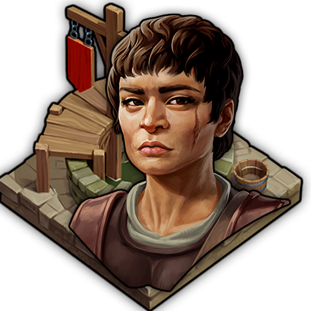
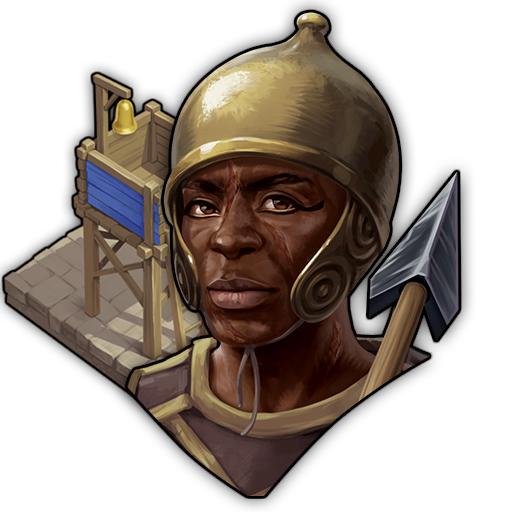
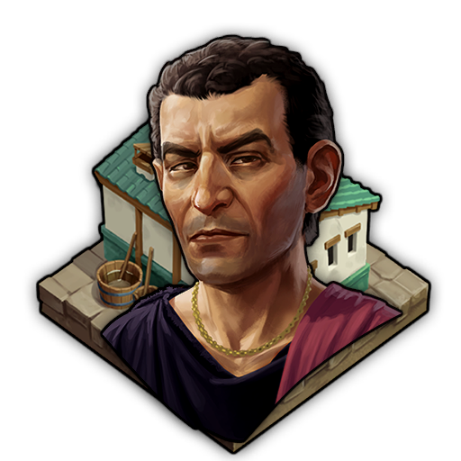
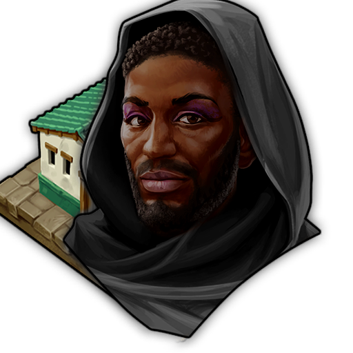

# Amenities Specialist Pack - Mod
This mod adds Specialist focused on Amenities into Anno 117. This Mod is part as a submod of "Extended Specialists Mod"
***
### Item Overview (AI Generated - Might contain Issues. Please point them out if you find some)
### Common Specialists
| Image Preview | GUID | Internal Name | Item name | Base/Standard Effects |
| :---: | :---: | :---: | :---: | :--- |
|  | 1600000040 | Specialist AE-Watchtower-C | Attentive Guard | **Functional Effect:** Area Effect on StreetDistance (Target: 43097). **Attribute Boosts:**  • +1 Happiness |
|  | 1600000052 | Specialist AE-Wells-C | Stationed Water Carrier | **Functional Effect:** Area Effect on StreetDistance (Target: 43097). **Attribute Boosts:**  • +1 FireSafety |
|  | 1600000503 | Specialist AE-Latrines-C | Happy Latrine Cleaner | **Functional Effect:** Area Effect on StreetDistance (Target: 43097). **Attribute Boosts:**  • +1 Health |

***

### Rare Specialists
| Image Preview | GUID | Internal Name | Item name | Base/Standard Effects |
| :---: | :---: | :---: | :---: | :--- |
|  | 1600000515 | Specialist AE-Wells-R | Superstitious Resident | **Functional Effect:** Area Effect on StreetDistance (Target: 43097). **Attribute Boosts:**  • +1.5 Belief,  • -0.5 FireSafety |
|  | 1600000511 | Specialist AE-Watchtower-R | Tax Collector | **Functional Effect:** Area Effect on StreetDistance (Target: 43097). **Attribute Boosts:**  • +1.5 Money,  • -0.5 Happiness |
|  | 1600000507 | Specialist AE-Latrines-R | Aspiring Spy | **Functional Effect:** Area Effect on StreetDistance (Target: 43097). **Attribute Boosts:**  • +1.5 Knowledge,  • -0.5 Health |

***

### Legendary Specialists
| Image Preview | GUID | Internal Name | Item name | Base/Standard Effects | Boosted Effects | Boost Condition |
| :---: | :---: | :---: | :---: | :--- | :--- | :--- |
|  | 1600000547 | Specialist AE-Watchtower-Money-L | Manius Rufus, Imperial Customs Guard | **Attribute Boosts:** • +2 Money, • +0.5 Knowledge **Functional Effect:** (Implicit Area Buff) | **Enhanced Adjacent Building Effect:** Area Effect on StreetDistance (Target: 43097). **Attribute Boosts:**  • +3 Money,  • +1 Knowledge | Needs a sufficiently large network of customs checkpoints to meet his quotas. (12x Watchtower on Island) |
|  | 1600000540 | Specialist AE-Latrines-Know-L | Nefer-Hor, Egyptian Master of Espionage | **Attribute Boosts:** • +0.5 Money, • +2 Knowledge, • -1 Health **Functional Effect:** (Implicit Area Buff) | **Enhanced Adjacent Building Effect:** Area Effect on StreetDistance (Target: 43097). **Attribute Boosts:**  • +1 Money,  • +3 Knowledge | Deaddrops are ideal for passing on information. (12x Latrine on Island) |
|  | 1600000554 | Specialist AE-Wells-Belief-L | Fontana Spes, hopeful Denari Donor | **Attribute Boosts:** • +0.5 Prestige, • +2 Belief, • -1 FireSafety **Functional Effect:** (Implicit Area Buff) | **Enhanced Adjacent Building Effect:** Area Effect on StreetDistance (Target: 43097). **Attribute Boosts:**  • +1 Prestige,  • +3 Belief | Addresses her followers from a sacred place. (1x Temple on Island) |
|  | 1600000519 | Specialist AE-Latrines-Health-L | Septimus Gutterius, Curator Latrinarium | **Attribute Boosts:** • +0.5 Population, • +1.5 Health **Functional Effect:** (Implicit Area Buff) | **Enhanced Adjacent Building Effect:** Area Effect on StreetDistance (Target: 43097). **Attribute Boosts:**  • +1 Population,  • +3 Health | Insists on regular health checkups for his staff. (4x Medici on Island) |
|  | 1600000526 | Specialist AE-Watchtower-Happy-L | Gaius Custos, the strict Guardian | **Attribute Boosts:** • +0.5 Prestige, • +2 Happiness **Functional Effect:** (Implicit Area Buff) | **Enhanced Adjacent Building Effect:** Area Effect on StreetDistance (Target: 43097). **Attribute Boosts:**  • +3 Happiness,  • +1 Prestige | Requires a minimum amount of custodia on site. (4x Custodia on Island) |
|  | 1600000533 | Specialist AE-Wells-FireSafety-L | Servius Aquila, Aquilex Romanus | **Attribute Boosts:** • +0.5 Prestige, • +2 FireSafety **Functional Effect:** (Implicit Area Buff) | **Enhanced Adjacent Building Effect:** Area Effect on StreetDistance (Target: 43097). **Attribute Boosts:**  • +1 Prestige,  • +3 FireSafety | Is pushing for an additional water supply for his wells. (3x Cistern on Island) |
